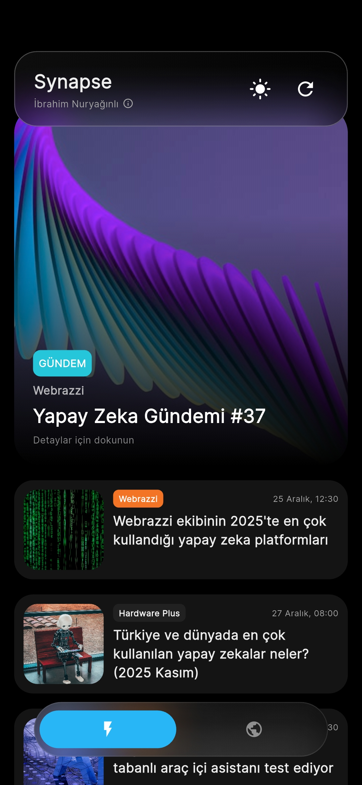
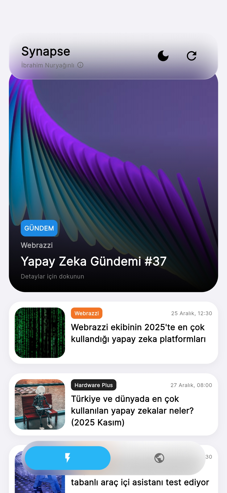
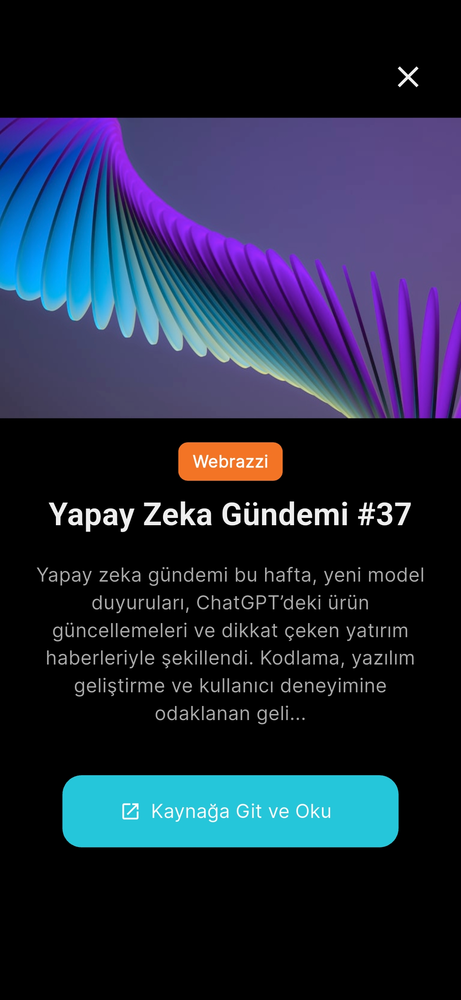
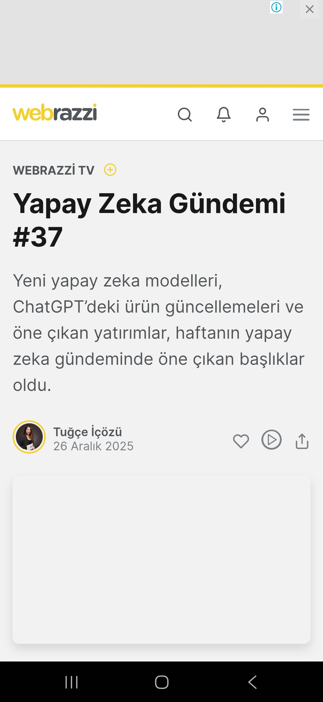

# Synapse 🧠


**Synapse**, teknoloji dünyasındaki en son gelişmeleri ve özellikle yapay zeka (AI) alanındaki kırılımları tek bir merkezde toplayan, modern ve akıllı bir mobil haber uygulamasıdır. 

"Liquid Glass" (Akışkan Cam) tasarım diliyle geliştirilen arayüzü, kullanıcıya premium bir okuma deneyimi sunar.

---

## 📸 Ekran Görüntüleri

| Ana Sayfa (Gündem) | Haber Detay (Glass) | Kaynak İçi Tarayıcı | Hakkında Overlay |
|:-----------------:|:-------------------:|:-------------------:|:----------------:|
|  |  |  |  |

*(Not: Projenizi forklayıp `assets` klasörüne ss1.png, ss2.png gibi ekran görüntüleri eklerseniz yukarıdaki alanlar otomatik dolar.)*

---

## ✨ Temel Özellikler

### 🚀 Gelişmiş Haber Motoru
*   **20+ Seçkin Kaynak:** ShiftDelete, Webtekno, DonanımHaber, BBC AI, Euronews, Swipeline ve daha fazlası.
*   **Akıllı Filtreleme:** Magazin, spam veya alakasız içerikleri temizleyen, sadece "Teknoloji ve AI" odaklı içerikleri süzen özel algoritma.
*   **Yapay Zeka Odaklı:** Başlık ve içerik taraması yaparak AI ile ilgili haberleri önceliklendirir ve puanlar.
*   **Otomatik Görsel Çıkarımı:** RSS akışında görsel olmayan haberler için sitenin `OG-Tags` verilerini tarayarak orijinal kapak fotoğrafını bulur.

### 🎨 Modern & Akışkan Arayüz (Glassmorphism)
*   **Apple-Style Liquid Glass:** Yüksek blur, ışık kırılmaları ve gradyan geçişleriyle zenginleştirilmiş UI bileşenleri.
*   **Immersive Experience:** Tam ekran modu ile dikkat dağıtıcı unsurlardan arındırılmış okuma.
*   **Dinamik Tema:** Cihaz ayarlarına veya kullanıcı tercihine göre Koyu/Açık mod desteği.
*   **İnteraktif Animasyonlar:** Sayfa geçişleri, açılır pencereler ve butonlarda akıcı animasyonlar.

### 📱 Kullanıcı Deneyimi (UX)
*   **Uygulama İçi Tarayıcı:** Haberlerin tamamını okumak için uygulamadan çıkmanıza gerek kalmaz.
*   **Geliştirici Paneli:** YouTube, GitHub ve LinkedIn bağlantılarına hızlı erişim sağlayan özel info overlay.
*   **Offline First:** Son çekilen haberleri bellekte tutarak hızlı açılış sağlar.

---

## 🛠 Kullanılan Teknolojiler ve Kütüphaneler

Bu proje **Flutter** kullanılarak geliştirilmiştir.

*   **Http & Html Parser:** RSS ve HTML tabanlı sitelerden veri kazıma (Web Scraping).
*   **Cached Network Image:** Görsellerin önbelleğe alınması ve performans optimizasyonu.
*   **Url Launcher:** Dış bağlantıların ve uygulama içi tarayıcının yönetimi.
*   **Intl:** Tarih formatlama ve yerelleştirme işlemleri.
*   **Font Awesome:** Sosyal medya ikonları ve görsel materyaller.
*   **Google Fonts:** Modern tipografi (Inter font ailesi).

---

## 📥 Kurulum (APK)

Uygulamanın en son sürümünü (APK) indirmek için **[Releases](https://github.com/ibodeth/Synapse/releases)** sayfasını ziyaret edebilirsiniz.

Kendi ortamınızda çalıştırmak için:

```bash
# Projeyi klonlayın
git clone https://github.com/ibodeth/Synapse.git

# Proje dizinine gidin
cd Synapse

# Paketleri yükleyin
flutter pub get

# Uygulamayı başlatın
flutter run
```

---

## 👨‍💻 Geliştirici

<div align="center">

**İbrahim Nuryağınlı**

[](https://www.youtube.com/@ibrahim.python)
[](https://github.com/ibodeth)
[](https://www.linkedin.com/in/ibrahimnuryaginli/)
[](https://ibodeth.github.io/)

</div>

---

## 📄 Lisans

Bu proje MIT lisansı ile lisanslanmıştır. Detaylar için `LICENSE` dosyasına bakabilirsiniz.
